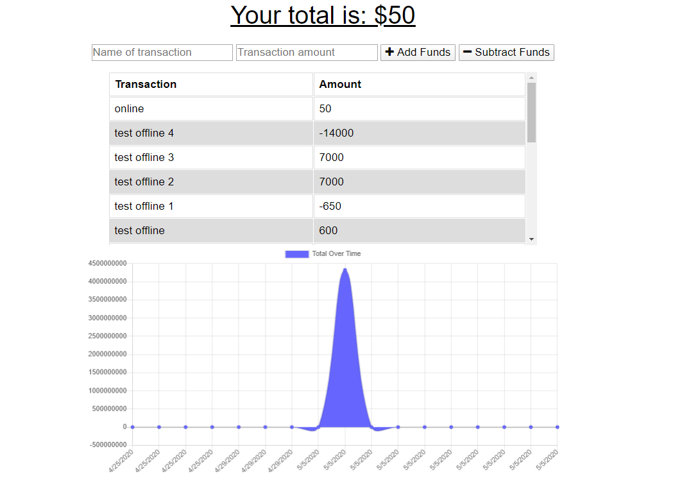

  # Week 18 PWA: Budget Tracker
  
  ## Description 

GIVEN a user is on Budget App without an internet connection
WHEN the user inputs a withdrawal or deposit
THEN that will be shown on the page, and added to their transaction history when their connection is back online.

---

Giving users a fast and easy way to track their money is important, but allowing them to access that information anytime is even more important. Having offline functionality is paramount to our applications success.

  ## User Story
  
  As a:
   Traveler 
  
  I want to:
   be able to track my withdrawals and deposits with or without a data/internet connection
   
  So that: my account balance is accurate when I am traveling

  ---
  
  
  ## Table of Contents
  
  * [Installation] npm i
  
  * [Usage] n/a
  
  * [License] MIT          
  
  
  ---
  
  ## Badges
    
 
  

  ## Screenshots

## MongoDB Credentials:
budget_user

password1

    
  ## Links 

  [Visit Portfolio Page](https://JesikaRenea.github.io/)

  [Github Repo: Week 18 PWA: Budget Tracker](https://github.com/JesikaRenea/Budget_Tracker)

  [Heroku Deployment](https://budget-tracker-jh.herokuapp.com)

  ## For Questions Contact:

  JesikaRenea:

  

  [JesikaRenea](https://github.com/JesikaRenea)
  
    ---
  